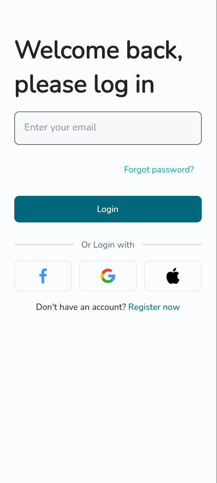
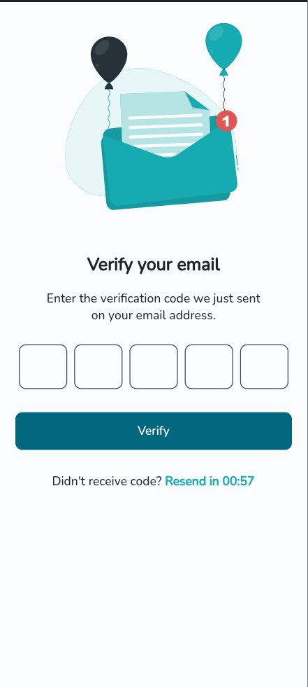
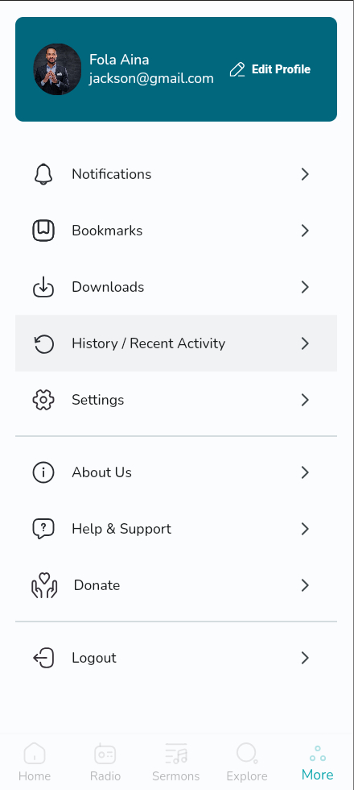
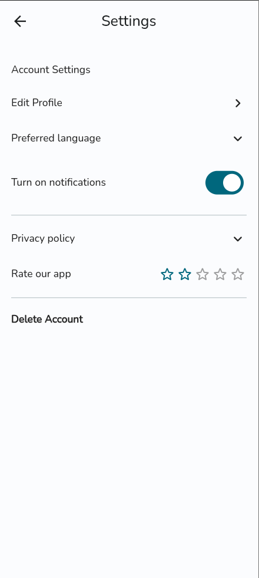
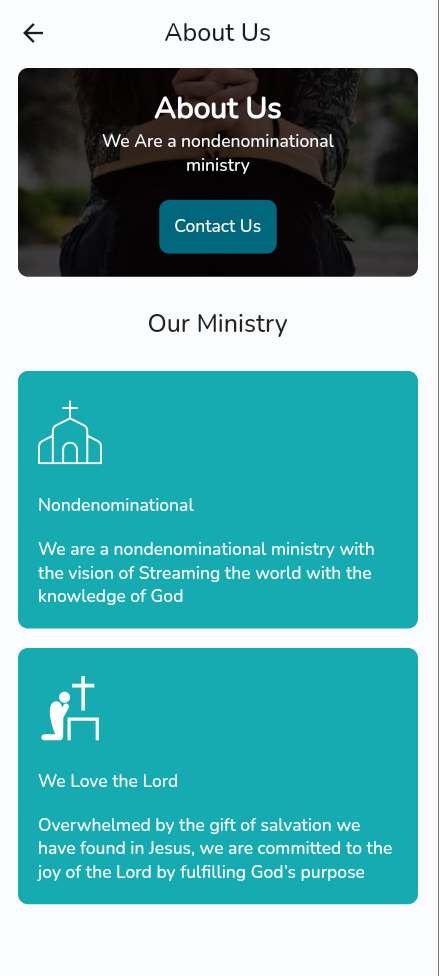

# Streamglobal

A flutter project that depicts a simple auth flow for a church app

## Description

The streamglobal app is a simple flutter app that depicts a simple auth flow for a church app. The
app has a simple login screen that allows users to login with their email. The app also has a create
account screen that allows users to create an account with their username and email.

## Features

- User-friendly create account screen with name, email and full name fields.
- Form validation for all fields to ensure accurate user input.
- Well-structured codebase that is easy to understand and maintain.

## Screenshots

<table>
<tr>
<td valign="top" width="50%">

</td>
<td valign="top" width="50%">

</td>
</tr>

<tr>
<td valign="top" width="50%">

</td>
<td valign="top" width="50%">

</td>
</tr>

<tr>
<td valign="top" width="50%">

</td>
<td valign="top" width="50%">

</td>
</tr>
</table>

## App Demo

The apk to the app can be found in the actions tab

## Installation

Clone the repository from Github:

``` bash
git clone https://github.com/logickoder/stream_global.git
```

Navigate to the project directory:

``` bash
cd stream_global
```

Run the app on your emulator or physical device:

```arduino
flutter run
```

## Requirements

Flutter installed on your system
Emulator or physical device for testing

## Contributing

Contributions are welcome! Please feel free to fork the repository and submit pull requests. Make
sure to follow the existing code conventions and try to include tests with your changes.

## License

This project is licensed under the MIT License - see the LICENSE file for details.